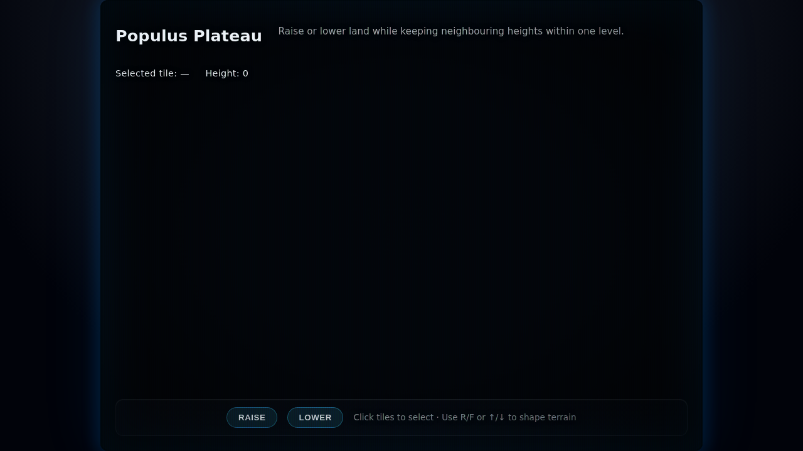

# Populus Plateau

A miniature Populus-inspired terrain toy rendered with Three.js. The 8×8 grid of vertices can only differ by one level from their neighbours, so every sculpting move must respect the classic rule set. Heights now span from `0` up to `6`, with a translucent sea settling at height `1`—flooding low spots while higher peaks poke through above the waterline.

## Controls

- Click a tile to focus it.
- Press **Raise**/**Lower** or use `R`/`F` (`↑`/`↓`) to nudge the selected vertex.
- The HUD displays the currently selected coordinate and height.

## Development notes

The scene is built with a single `PlaneGeometry` (7×7 quads = 8×8 vertices). Each adjustment updates vertex positions and colours before recomputing normals for crisp shading. The `canSetHeight` helper refuses edits that would exceed ±1 difference relative to orthogonal neighbours. The playfield sits inside a broader 10×10 presentation grid so the plateau feels embedded within a stylised arena.

## Screenshot

